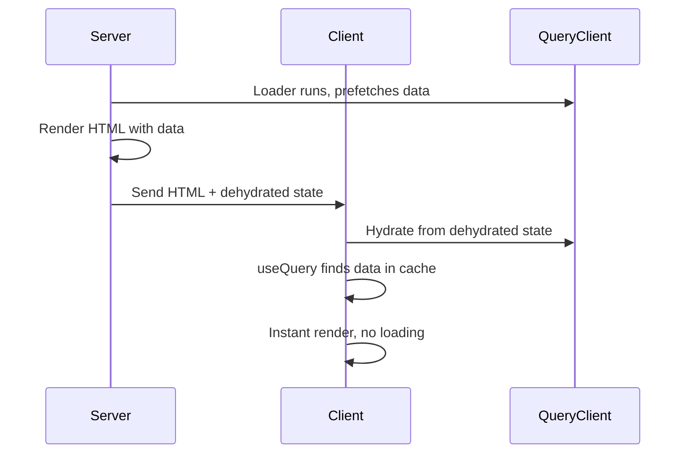
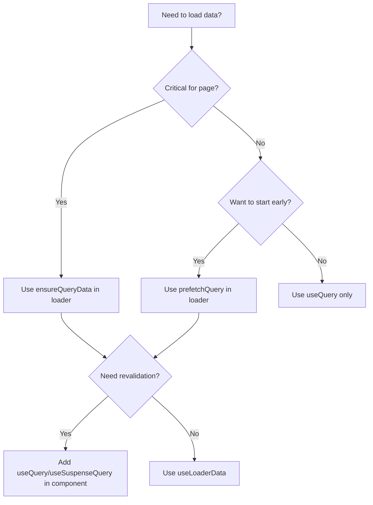

# Data Loading Patterns

_Best practices for data loading with TanStack Start, Router, and Query._

## Overview

This guide covers best practices for data loading in TanStack Start applications, focusing on the integration between TanStack Router loaders and TanStack Query. It also covers two ways to reach your backend from a loader:

1. **Server functions** (`createServerFn`) — server-only functions callable from anywhere.
2. **An isomorphic typed API client** (e.g. oRPC, tRPC, Eden Treaty) — one import that runs in both the browser and SSR loaders.

### One isomorphic data path (recommended)

A typed API client can be made **isomorphic** — the same import works in browser hooks, components, mutations, AND SSR route loaders. A helper such as `createIsomorphicFn` provides a `.client()` branch (native `fetch` with `credentials: "include"`) and a `.server()` branch (cookie header forwarded via the inbound request headers, request routed to the backend Worker). TanStack Start's Vite plugin tree-shakes the server branch out of the browser bundle.

With this approach, server functions are still useful for **web-only** cookie work (e.g. theme cookie reads/writes), but they are NOT the SSR data path for API resources. Routing all SSR through server functions is a common early decision that later gets replaced by the isomorphic client.

## Server Loaders vs useQuery

### When to Use Server Loaders

| Aspect           | Server Loader           | useQuery                       |
| ---------------- | ----------------------- | ------------------------------ |
| Initial paint    | Faster (data in HTML)   | Slower (loading spinner)       |
| Navigation       | Blocks until data ready | Instant, shows loading         |
| SEO              | Better (SSR content)    | Requires extra setup           |
| Revalidation     | Manual                  | Automatic (staleTime, focus)   |
| Cache management | Basic                   | Advanced (dedup, invalidation) |

### Recommended Approach: Hybrid

Combine both for optimal UX:

- **Loaders** for initial data prefetching (using the API client directly)
- **useQuery** for cache management and revalidation (using `queryOptions`)

## Setting Up the Integration

### 1. Router with QueryClient

```typescript
// app/router.tsx
import { routerWithQueryClient } from "@tanstack/react-router-with-query";
import { QueryClient } from "@tanstack/react-query";
import { createRouter as createTanStackRouter } from "@tanstack/react-router";

export function createRouter() {
  const queryClient = new QueryClient({
    defaultOptions: {
      queries: {
        staleTime: 5 * 60 * 1000, // 5 minutes
        gcTime: 10 * 60 * 1000,   // 10 minutes
      },
    },
  });

  return routerWithQueryClient(
    createTanStackRouter({
      routeTree,
      context: { queryClient },
      defaultPreload: "intent", // Preload on hover
    }),
    queryClient
  );
}
```

### 2. Root Route with Context

```typescript
// app/routes/__root.tsx
import { createRootRouteWithContext } from "@tanstack/react-router";
import type { QueryClient } from "@tanstack/react-query";

interface RouterContext {
  queryClient: QueryClient;
}

export const Route = createRootRouteWithContext<RouterContext>()({
  component: RootComponent,
});
```

## Approach A: Server Functions

Server functions run **only on the server** but can be called from anywhere (loaders, components, hooks).

### Creating Server Functions

```typescript
// lib/server-functions.ts
import { createServerFn } from "@tanstack/start";

// GET for fetching data
export const getYourEntity = createServerFn("GET", async (id: string) => {
  // Server-only code: DB access, env vars, etc.
  const result = await db.query.yourEntities.findFirst({
    where: eq(yourEntities.id, id),
  });
  return result;
});

// POST for mutations
export const updateYourEntity = createServerFn(
  "POST",
  async (data: { id: string; updates: UpdateInput }) => {
    const result = await db
      .update(yourEntities)
      .set(data.updates)
      .where(eq(yourEntities.id, data.id))
      .returning();
    return result[0];
  }
);
```

### Input Validation

Always validate inputs crossing the network boundary:

```typescript
import { createServerFn } from "@tanstack/start";
import { z } from "zod";

const inputSchema = z.object({
  id: z.string().uuid(),
  page: z.number().min(1).default(1),
  limit: z.number().min(1).max(100).default(10),
});

export const getYourEntities = createServerFn("GET", async (input: unknown) => {
  const validated = inputSchema.parse(input);
  // Use validated.id, validated.page, etc.
});
```

## Query Options Pattern

Define reusable query options that combine query keys with the data source (server function or API client):

```typescript
// hooks/query-options.ts
import { queryOptions } from "@tanstack/react-query";
import { getYourEntity, getYourEntities } from "@/lib/server-functions";

export const yourEntityKeys = {
  all: ["yourEntities"] as const,
  lists: () => [...yourEntityKeys.all, "list"] as const,
  list: (params: PaginationParams) => [...yourEntityKeys.lists(), params] as const,
  details: () => [...yourEntityKeys.all, "detail"] as const,
  detail: (id: string) => [...yourEntityKeys.details(), id] as const,
};

export const yourEntityQueryOptions = (id: string) =>
  queryOptions({
    queryKey: yourEntityKeys.detail(id),
    queryFn: () => getYourEntity(id),
    staleTime: 5 * 60 * 1000,
  });

export const yourEntitiesQueryOptions = (params: PaginationParams) =>
  queryOptions({
    queryKey: yourEntityKeys.list(params),
    queryFn: () => getYourEntities(params),
    staleTime: 10 * 60 * 1000,
  });
```

## Approach B: Isomorphic API Client

When you use a typed API client (`api` for direct calls, plus a TanStack Query helper such as `apiQuery`/`orpc` that builds specs), hooks build query/mutation specs through the helper. The canonical pattern is to let the helper build the spec and override `queryKey` only when the hook participates in an SSR-loader handshake (matching key).

```typescript
// hooks/use-your-entity.ts
import { apiQuery } from "@/lib/api-client";
import { useQuery, useMutation, useQueryClient } from "@tanstack/react-query";

export const yourEntityKeys = {
  all: ["yourEntities"] as const,
  list: () => [...yourEntityKeys.all, "list"] as const,
  detail: (id: string) => [...yourEntityKeys.all, "detail", id] as const,
};

export const useYourEntity = (id: string) =>
  useQuery({
    ...apiQuery.yourContext.getYourEntity.queryOptions({ input: { id } }),
    queryKey: yourEntityKeys.detail(id),
    enabled: !!id,
  });

export const useYourEntities = () =>
  useQuery({
    ...apiQuery.yourContext.listYourEntities.queryOptions({ input: {} }),
    queryKey: yourEntityKeys.list(),
  });

export const useUpdateYourEntity = () => {
  const qc = useQueryClient();
  return useMutation({
    ...apiQuery.yourContext.updateYourEntity.mutationOptions(),
    onSuccess: () => qc.invalidateQueries({ queryKey: yourEntityKeys.all }),
  });
};
```

Import row/DTO types from your API contract package (e.g. `import type { EntityRow, RelatedRecord } from "@repo/api-contract"`), NOT from the application layer.

## Loader Patterns

The loader and the consumer hook share the `queryKey` so the cache hydrates on the client. The examples below show the API-client form; the server-function form is identical except `queryFn` calls a server function.

### Pattern 1: Blocking Prefetch (`ensureQueryData`)

Use when data is **critical** for the page. Navigation waits for data.

```typescript
// routes/_authenticated/your-entities/$id.tsx
import { api } from "@/lib/api-client";
import { yourEntityKeys, useYourEntity } from "@/hooks/use-your-entity";

export const Route = createFileRoute("/_authenticated/your-entities/$id")({
  loader: ({ context: { queryClient }, params: { id } }) =>
    queryClient.ensureQueryData({
      queryKey: yourEntityKeys.detail(id),
      queryFn: () => api.yourContext.getYourEntity({ id }),
    }),
  component: YourEntityDetailPage,
});

function YourEntityDetailPage() {
  const { id } = Route.useParams();
  // Hook uses the same queryKey — finds prefetched data in cache, no extra request
  const { data } = useYourEntity(id);
}
```

### Pattern 2: Non-Blocking Prefetch (`prefetchQuery`)

Use when you want to **start fetching** but not block navigation.

```typescript
export const Route = createFileRoute("/_authenticated/your-entities/")({
  loader: ({ context: { queryClient } }) => {
    // Fire and forget - doesn't block navigation
    queryClient.prefetchQuery({
      queryKey: yourEntityKeys.list(),
      queryFn: () => api.yourContext.listYourEntities({}),
    });
  },
  component: YourEntitiesComponent,
});

function YourEntitiesComponent() {
  // If prefetch finished, data is in cache - no loading
  // If not, shows loading state and waits for data
  const { data, isLoading } = useYourEntities();
}
```

### Pattern 3: Mixed (Critical + Non-Critical)

```typescript
loader: async ({ context: { queryClient }, params: { id } }) => {
  // Start fetching comments ASAP, but don't block
  queryClient.prefetchQuery({
    queryKey: commentKeys.list(id),
    queryFn: () => api.comments.list({ entityId: id }),
  });

  // Block navigation until main data is ready
  await queryClient.ensureQueryData({
    queryKey: yourEntityKeys.detail(id),
    queryFn: () => api.yourContext.getYourEntity({ id }),
  });
},
```

### How SSR cookies reach the API

The loader runs on the server. When it calls `api.yourContext.getYourEntity({ id })`, the `.server()` branch of the isomorphic client reads the inbound request's cookie (via the request headers) and forwards it on the outgoing fetch. In a Cloudflare Workers deployment the request is routed through a Service Binding to hit the API Worker directly (zero-latency inter-worker; falls back to plain HTTP locally). The session cookie reaches the API without manual plumbing.

## Hybrid SSR + Client Data

### Syncing Server-Loaded Data with useQuery

When you want the first page from the server but subsequent pages from the client, the shared `queryKey` is what makes the handshake work.

```typescript
// routes/_authenticated/your-entities/index.tsx
import { api } from "@/lib/api-client";

const firstPageKey = yourEntityKeys.list({ page: 1, limit: 5 });

export const Route = createFileRoute("/_authenticated/your-entities/")({
  loader: ({ context: { queryClient } }) =>
    queryClient.ensureQueryData({
      queryKey: firstPageKey,
      queryFn: () => api.yourContext.listYourEntities({ page: 1, limit: 5 }),
    }),
  component: YourEntitiesComponent,
});

function YourEntitiesComponent() {
  const [pagination, setPagination] = useState({ pageIndex: 0, pageSize: 5 });
  const input = { page: pagination.pageIndex + 1, limit: pagination.pageSize };

  const { data, isLoading } = useQuery({
    ...apiQuery.yourContext.listYourEntities.queryOptions({ input }),
    queryKey: yourEntityKeys.list(input),
    // Keep previous data while fetching next page
    placeholderData: (previousData) => previousData,
  });

  // First page: instant (from loader cache)
  // Subsequent pages: loading state, then data
}
```

### Why This Works

1. **Loader** prefetches under `queryKey = yourEntityKeys.list({ page: 1, limit: 5 })`.
2. **useQuery** on the first page uses the same `queryKey` and finds the prefetched data — **no loading spinner**.
3. **Subsequent pages** use a different `queryKey` (different input), so the hook fetches.
4. `placeholderData` keeps page 1 visible while page 2 loads.

The same contract serves both runtimes, so behavior stays consistent.

## Dehydration / Hydration (SSR)

TanStack Router + Query integration handles this automatically:



The framework:

1. **Server**: Dehydrates initial queries after render
2. **Client**: Hydrates the cache before React renders
3. **Streaming**: Queries that resolve during SSR are streamed to client

## File Organization

Recommended structure for server-side code:

```
src/
├── lib/
│   ├── api-client.ts           # Isomorphic API client (api + query-helper exports)
│   ├── api-fetch.ts            # Inter-worker fetch (e.g. Cloudflare Service Binding)
│   ├── server-functions.ts     # createServerFn wrappers (web-only cookie work)
│   └── server/                 # Server-only utilities
│       ├── db.server.ts        # Database connections
│       └── auth.server.ts      # Auth utilities
├── hooks/
│   ├── query-options.ts        # Reusable queryOptions
│   └── use-your-entities.ts
└── routes/
    └── _authenticated/
        └── your-entities/
            ├── index.tsx
            └── $id.tsx
```

**File naming conventions:**

- `.server.ts` - Server-only code, never bundled to client
- `.client.ts` - Client-only code
- `.ts` - Isomorphic code (safe for both)

## Important Caveats

### Loaders are Isomorphic

Route loaders run on **both server and client** (the server runs them on initial navigation; the client runs them on subsequent client-side navigations). Don't put sensitive logic or DB code directly in loaders — keep that behind the API contract:

```typescript
// BAD - exposes secret / DB code to the client bundle
loader: async () => {
  const apiKey = process.env.SECRET_API_KEY; // Leaked!
  const result = await db.query.yourEntities.findFirst(/* ... */);
}

// GOOD - call the API client; cookie is forwarded automatically on the server branch
loader: ({ context, params }) =>
  context.queryClient.ensureQueryData({
    queryKey: yourEntityKeys.detail(params.id),
    queryFn: () => api.yourContext.getYourEntity({ id: params.id }),
  });
```

### Serialization Limits

Data returned from loaders must be serializable. These are **not supported**:

- `undefined` (use `null` instead)
- `Date` objects (use ISO strings)
- `Map`, `Set`, `BigInt`
- `Error` objects
- Functions

Use [superjson](https://github.com/blitz-js/superjson) if you need these types.

### JSON wire vs Date

A typed API client that reflects the JSON wire (e.g. a `JsonifiedClient` type) surfaces this on the consumer side: contract `Date` fields appear as `string` at the call site. Treat them as strings throughout the consumer; cast to `new Date(s)` only at the leaf where a `Date` is genuinely required (e.g. a date formatter that demands a `Date`). A `formatDate` helper that accepts a `string` and parses internally lets you pass ISO strings from the API directly.

### Cache Invalidation

After mutations, invalidate relevant queries:

```typescript
const queryClient = useQueryClient();

const mutation = useMutation({
  ...apiQuery.yourContext.updateYourEntity.mutationOptions(),
  onSuccess: (_, variables) => {
    // Invalidate list and detail
    queryClient.invalidateQueries({ queryKey: yourEntityKeys.lists() });
    queryClient.invalidateQueries({
      queryKey: yourEntityKeys.detail(variables.id),
    });
  },
});
```

## Decision Tree



## Sources

- [Server Functions | TanStack Start Docs](https://tanstack.com/start/latest/docs/framework/react/guide/server-functions)
- [Execution Model | TanStack Start Docs](https://tanstack.com/start/latest/docs/framework/react/guide/execution-model)
- [Using Server Functions and TanStack Query](https://www.brenelz.com/posts/using-server-functions-and-tanstack-query/)
- [TanStack Router Data Loading](https://frontendmasters.com/blog/tanstack-router-data-loading-1/)
- [Prefetching & Router Integration | TanStack Query Docs](https://tanstack.com/query/latest/docs/framework/react/guides/prefetching)
- [Server Rendering & Hydration | TanStack Query Docs](https://tanstack.com/query/latest/docs/framework/react/guides/ssr)
